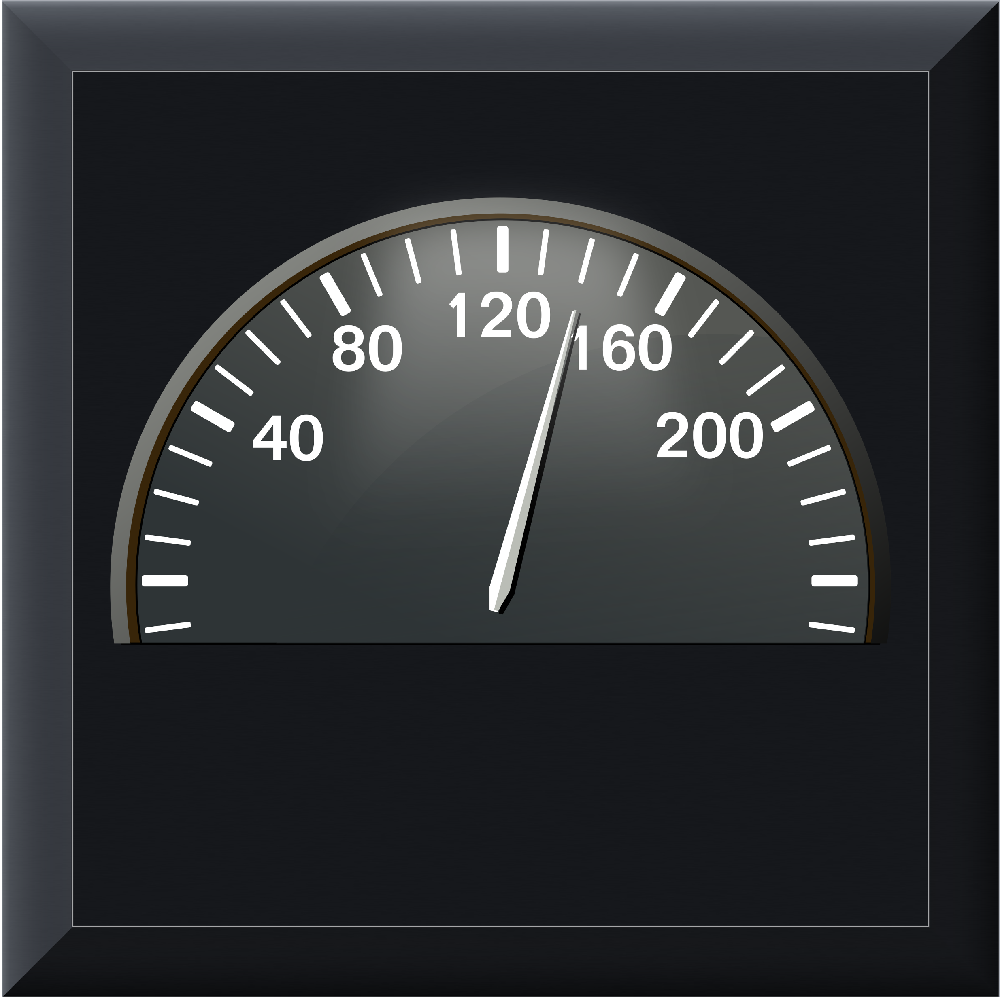

# GAiges — Real-Time Performance Dashboard for Claude Code

<p align="center">
  
</p>

**A gorgeous, physics-driven analog gauge cluster that monitors your Claude Code sessions in real-time.** Track token throughput, context window usage, cache efficiency, and more — rendered as vintage instrument gauges with spring-damper needle animation and rolling mechanical odometers.

Built for developers who use [Claude Code](https://docs.anthropic.com/en/docs/claude-code) (Anthropic's AI coding assistant CLI) and want live visibility into session performance without leaving the terminal workflow.

---

## Skins

GAiges ships with three hand-crafted dashboard skins:

### Vintage Wood
Classic warm-toned instrument cluster with glowing cyan and amber needles, glass overlay, and mechanical drum odometer.

### Modern Dark
Clean, minimal dark theme with bold red supercar needles, yellow fuel indicator, and digital odometer readout.

### Mad Max
Post-apocalyptic wasteland gauges — weathered metal, cracked glass, rusty needle physics. Because your token budget deserves drama.

---

## What It Monitors

| Gauge | Metric | Description |
|-------|--------|-------------|
| **Speedometer** | Tokens/sec | Real-time output token generation speed (per-response, excludes idle time) |
| **Boost / Latency** | Cache hit ratio | How much of your context is served from Anthropic's prompt cache (0-100%) |
| **Fuel** | Context remaining | How much of your 1M token context window is still available |
| **Odometer** | Total output tokens | Cumulative token counter for the session with rolling drum animation |
| **Clock** | Local time | Analog chronograph with hour, minute, and second hands |
| **Check Engine LED** | Session health | Lights up when generation has stalled or the session appears dead |
| **TTFT** | Time to first token | Latency from your message to first assistant response (select skins) |

---

## Features

- **Spring-damper needle physics** with per-gauge idle quiver — needles settle naturally, not digitally
- **Three dashboard skins** — vintage, modern, and mad max, each with unique needle sets and glass overlays
- **Mechanical drum odometer** with rolling digit strips and smooth ease-out animation
- **60fps rendering** via tkinter canvas with efficient image compositing
- **Automatic session detection** — finds the most recent Claude Code JSONL session file
- **No API calls** — reads local session files only, zero network overhead
- **Works with any Claude Code session** — no MCP server or plugins required
- **Resizable window** locked to native aspect ratio
- **Check engine indicator** for stalled or dead sessions

---

## Installation

### From PyPI (coming soon)

```bash
pip install gaiges
```

### From Source

```bash
git clone https://github.com/rhetorictech/gaiges.git
cd gaiges
pip install -e .
```

### Requirements

- Python 3.9+
- [Pillow](https://python-pillow.org/) (installed automatically)
- macOS, Linux, or Windows with tkinter support
- An active [Claude Code](https://docs.anthropic.com/en/docs/claude-code) session (generates the JSONL files GAiges reads)

---

## Usage

```bash
# Launch the dashboard
gaiges

# Or run as a module
python -m gaiges
```

A skin picker dialog appears on launch. Select your dashboard and the gauges begin tracking your most recent Claude Code session immediately.

### macOS Automator App

GAiges can be wrapped in an Automator Application for one-click launch from the Dock. Create a new Automator Application with a "Run Shell Script" action:

```bash
/path/to/your/venv/bin/gaiges
```

---

## How It Works

GAiges polls the most recently modified `.jsonl` session file in `~/.claude/projects/` every 1.5 seconds. It parses Claude's API response messages to extract:

- **`output_tokens`** — generation volume per response
- **`input_tokens`**, **`cache_creation_input_tokens`**, **`cache_read_input_tokens`** — context composition and cache efficiency
- **Timestamps** — for per-response throughput calculation (idle time between turns is excluded)

All processing is local. No data leaves your machine. No API keys required.

---

## Architecture

```
gaiges/
  __init__.py          # Package metadata
  __main__.py          # Entry point
  cluster.py           # Dashboard engine — skins, gauges, animation, data parsing
  assets/              # Dashboard images, needle PNGs, glass overlays, odometer drums
```

The rendering engine uses PIL/Pillow for image compositing (needle rotation, odometer drum strips, glass overlays) and tkinter Canvas for display. Needle positions are driven by a spring-damper physics model with configurable damping, spring constant, and per-gauge jitter frequency.

---

## Configuration

Gauge parameters are defined per-skin in the `SKINS` dictionary in `cluster.py`. Each gauge specifies:

- **`cx`, `cy`** — center position on the 1376x752 native canvas
- **`r`** — gauge radius (controls needle scaling)
- **`start`, `sweep`** — angle range in degrees (math convention: 0=3 o'clock, 90=12 o'clock)
- **`max`** — maximum data value for full-scale deflection
- **`needle`** — needle image type (each with its own hub position and tip distance)
- **`data_key`** — which parsed metric drives this gauge

---

## Keywords

Claude Code, Anthropic, AI performance monitor, LLM dashboard, token usage tracker, tokens per second, throughput monitor, context window gauge, prompt cache efficiency, real-time AI monitoring, developer tools, CLI dashboard, AI pair programming, coding assistant metrics, Python tkinter gauge, analog instrument cluster, speedometer widget, odometer animation, spring-damper physics, needle animation, vintage dashboard, steampunk gauge, mad max UI, retro instrument panel, Claude API metrics, AI session monitor, token counter, cache hit ratio, context budget tracker

---

## License

MIT License. See [LICENSE](LICENSE) for details.

---

## Credits

Built by [RhetoricTech](https://rhetorictech.ai). Dashboard artwork and needle assets are original creations.

<p align="center">
  <em>Because every token deserves to be measured with style.</em>
</p>
